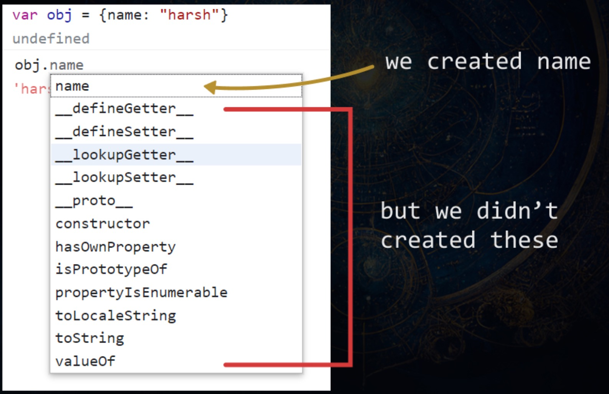

*Let, Const, Var, Differences Between Them-*

``` javascript
    var name = "xyz"; 
    var name = "abc"; // this is the valid 
    name = "xyz"; //this is also valid 
    console log(name);

    let name = "xyz";
    let name = "abc"; // this is not the valid
    name = "xyz"; //this is  valid

    const name = "xyz";
    const name = "abc"; // this is not valid
    name = "xyz"; //this is also not valid
```
*Scoping Of Var Let And Const-*

var is function scope and let, and const are block scope means

``` javascript
function scope(){
    var name = "xyz";
}
console.log(name);  // can't access name variable

if(true){
    var name = "xyz";    // this is accessible that's why this is a function scope
    let name = "xyz";
    const name = "abc";  // same as above
}
console.log(name); // can't access name variable
```

*Hoisting-*

``` javascript
    console.log(name);
    var name = "xyz"; //undefined
    let name = "abc"; // this gives an error also const give error
```

*Data types-*  javascript is dynamic type language

types =     primitive data type || reference data type
            12, 12.4, "harsh", true, a, null, undefined  ->this is primitive data type
            [] , () , {} , map , set ,date  - reference dt                ->this is refernce data type


*truthy and falsy values-*

null undefined NaN 0 " "  ' ' document.all -> Flasy
baaki sab truthy                          -> turely

*loops-*
            for , while , do while , for-each , for-in , for-out 

*array-*

``` javascript
const array = ["javascript", "java","cpp","python"];

let arr = new Array(1, 2, 3, 4);
let emptyArr = new Array(5); // Creates an array using Constructor


console.log(array[3]);  // accessing array elements
arr[1] = 10; // Modify second element


console.log(array.length);  // array length

// add element into array
array.push("php") ;  // push is helps to add in last
array.unshift ("dart");  // unshift is use to add in first

// remove element from array
array.pop(); // remove from last
array.shift(); // remove from first

// splice() method is used to add, remove, or replace elements in an array.
 array.splice(start, deleteCount, item1, item2, ...);

// Example: Using find, findIndex, slice, concat, and includes array methods together

const numbers = [1, 2, 3, 4, 5];

// Using find to get the first number greater than 3
const foundNumber = numbers.find(num => num > 3);
console.log("Found Number:", foundNumber); // Output: 4

// Using findIndex to get the index of the first number greater than 3
const foundIndex = numbers.findIndex(num => num > 3);
console.log("Index of Found Number:", foundIndex); // Output: 3

// Using slice to get a portion of the array
const slicedArray = numbers.slice(1, 4);
console.log("Sliced Array:", slicedArray); // Output: [2, 3, 4]

// Using concat to combine arrays
const arr1 = [6, 7];
const combinedArray = numbers.concat(arr1);
console.log("Combined Array:", combinedArray); // Output: [1, 2, 3, 4, 5, 6, 7]

// Using includes to check if a value exists in the array
const hasThree = numbers.includes(3);
console.log("Array has 3:", hasThree); // Output: true
const hasTen = numbers.includes(10);
console.log("Array has 10:", hasTen); // Output: false


// Example: Using map, reduce, filter, and sort array methods together 

// all are gives you new array

const numbers = [1, 2, 3, 4, 5];

// Using map to double each number
const doubledNumbers = numbers.map(num => num * 2);

// Using filter to keep only even numbers
const evenNumbers = doubledNumbers.filter(num => num % 2 === 0);

// Using reduce to calculate the sum of even numbers
const sumOfEvenNumbers = evenNumbers.reduce((total, num) => total + num, 0);

// Using sort to sort the numbers in ascending order
const sortedNumbers = numbers.sort((a, b) => a - b);

console.log("Original Numbers:", numbers); // Output: [1, 2, 3, 4, 5]
console.log("Doubled Numbers:", doubledNumbers); // Output: [2, 4, 6, 8, 10]
console.log("Even Numbers:", evenNumbers); // Output: [2, 4, 8, 10]
console.log("Sum of Even Numbers:", sumOfEvenNumbers); // Output: 24
console.log("Sorted Numbers:", sortedNumbers); // Output: [1, 2, 3, 4, 5] (sorted in ascending order)


// Destructuring the array
const arr = [10, 20, 30, 40];

// Destructuring the array to get the first and third elements
const [first, , third] = arr;

console.log(first); // Output: 10
console.log(third); // Output: 30


// Example: Combining array elements and collecting the rest using rest and spread operators
const numbers = [1, 2, 3, 4, 5];

// Destructuring with the rest operator
const [first, ...rest] = numbers;

console.log(first); // Output: 1
console.log(rest); // Output: [2, 3, 4, 5]

// Combining with spread operator
const combinedArray = [first, ...rest, 6, 7];

console.log(combinedArray); // Output: [1, 2, 3, 4, 5, 6, 7]


```

// in short all things 

Accessing array elements: console.log(array[3])
Modify array element: arr[1] = 10
Array length: console.log(array.length)
push , pop , shift , unshift methods
map , filter , reduce , sort , find , findIndex , slice , includes
Destructuring an array
rest and spread operators

*functions-*
            functions
                |
            es5           and                 es6
functon statements,                      fat arrow function
function expressions,                           a) basic fat arrow
anonymous function                              b) fat arrow with one param
                                                c) fat arrow with implicit return
``` javascript
function abc(){
    // function statment
}

var abc=function(){
    // function expression                                  this is for es5
} 

function(){
    // anonymous function
}


var abc = () => {
    // basic fat arrow
}


var abc = (a) => {
    // fat arrow with one param
}
abc(12)

var abc = () => {
    //fat arrow with implicit return
    return 12;
}
console.log(abc())

```
1) can you explain what is higher order function ?

Higher-order functions are functions that either accept another function as a parameter, return a function, or both. For example, the forEach method always takes another function inside it, making it a higher-order function.

2) what is First Class Functions

A language is said to have first-class functions when functions are treated as normal values, similar to variables. This means you can save them, pass them as arguments to other functions, and return them from functions.

``` javascript
//  1 -> Assigning a function to a variable
   let name = function(){
     console.log("Hello")
   }
// 2 -> Passing a function as an argument
    function a(){
        return "test";
    }

    function main(fun,name){
        console.log(fun(),name);
    }
    main(a, "Hello");  // test Hello
// 3-> returning a function to another function
    function a(){
        return function b(){
            console.log("Hello"); 
        }
    }

    a()(); // Hello
```

3) What are Constructor Functions

Any NormalFunction In Js Which Whenever Called With "New" Keyword,Returns An Object If We Use "This" Keyword Inside That Function, It Returns An Object With All Of The Properties And Methods Mentioned Inside That Function With This Keyword, Such Function Is Called Constructor Function.

```javascript
function abcd(){
    this.name = "xyz"; // constructor function
}
let person1 = new abcd();  // new keyword in-front of function call makes a new blank object and returns to the person1 variable.
```
4) First Order Fncs

Does not accept other functions as parameters and does not return functions.
``` javascript
function add(a, b) {
    return a + b;
}

console.log(add(2, 3)); // Outputs: 5
```

5) What is the NEW keyword How you'll explain it ?

In JavaScript, the new keyword is used to create an instance of an object based on a constructor function. The new keyword creates a new empty object and sets the this keyword to point to the new object.

To understand the new keyword, do this:
Whenever you encounter the new keyword, always imagine a blank pair of curly braces {}, which means a blank object. Now move inside the function which is called just after the new keyword. Inside that function, all of the this keyword instances will add properties and methods inside the new object.

``` javascript
    function abcd(){
        this.name = "xyz";      // put()in place of this keyword we add name property in object
                                // like this {   "name": "xyz  }
    }

    let person1 = new abcd();

    // new keyword is create black object
```

*Objects-*
*How many ways to create objects in JavaScript?-*
1)Using the Object constructor:
```javascript        
var object = new Object(); 
```
2)Using Object.create:
```javascript
        var object = Object.create(null);
```
3)Using object literal syntax:
```javascript
        var object = { name: "XYZ", age: 7 };
```
4)Using a constructor function:
```javascript
        function Individual(username) {
            this.username = username;
            this.location = "Bhopal";
        }
        var object = new Individual("XYZ");
```
5)Using the ES6 class syntax:
```javascript
        class individual{
            constructor(username) {
                this.username = username
            }
        }
        var object = new individual("XYZ");
```
<!-- ACCESSING OBJECTS PROPERTIES TWO WAYS. -->
Dot notation:
```javascript
var obj = { name: "harsh" };
console.log(obj.name);  // Output: harsh
```
Bracket notation:
```javascript
var obj = { name: "harsh" };
console.log(obj['name']);  // Output: harsh
```
<!-- adding elements -->
```javascript
let obj = {}
obj.name = "XYZ"
```
<!-- delete object property -->
```javascript
var obj = { name: "harsh" };
delete obj.name;
console.log(obj.name);  // Output: undefined
```
```javascript
// extra example for object and adding symbol data type how to create and access
let mysym = Symbol("key1");
let jsuser = {
    name:"xyz",
    "fullName":"xyzABC",
    [mysym]:"mykey1",  // how to access this property :- jsuser[mysym]
    age : 18,
    location : "landon",
    email : "xyz@gmail.com"
}

console.log(jsuser.name);
console.log(jsuser["name"]);
console.log(jsuser["fullName"]);
```

Object Destructuring in JavaScript

```javascript
    const person = {
        name: 'XYZ',
        age: 25,
        location: 'Bhopal'
};
Using Destructuring:
const { name, age, location } = person;

console.log(name);      // Output: XYZ
console.log(age);       // Output: 25
console.log(location);  // Output: Bhopal

```
*Promises, Async & Await,fetch-*:

```javascript
    // create first way
let promiseOne = new Promise(function (resolve, reject) {
  setTimeout(function () {
    console.log("async take 1");
    resolve();
  });
});

promiseOne.then(function () {
  console.log("async take 1 resolved");
});

// create second way

new Promise(function (resolve, reject) {
  setTimeout(function () {
    console.log("async take 2");
    resolve();
  });
}).then(function () {
  console.log("async take 2 resolved");
});

// create third way

let promisethree = new Promise(function (resolve, reject) {
  setTimeout(function () {
    resolve({ user: "XYZ", email: "XYZ@gmail.com" });
  }, 1000);
});

promisethree.then(function (user) {
  console.log(user);
  console.log("async take 3 resolved");
});

// create fourth way

let promisefour = new Promise(function (resolve, reject) {
  setTimeout(function () {
    let error = false;
    if (!error) {
      resolve({ username: "XYZ", email: "XYZ@gmail.com" });
    } else {
      reject("error is there");
    }
  });
});

promisefour
  .then(function (user) {
    console.log(user);
    return user.username;
  })
  .then(function (username) {
    console.log(username);
  })
  .catch(function (err) {
    console.log(err);
  })
  .finally(function () {
    console.log("the promise either resolved or rejected");
  });

// create fifth way

let promisefifth = new Promise(function (resolve, reject) {
  setTimeout(function () {
    let error = false;
    if (!error) {
      resolve({ username: "XYZ", email: "XYZ@gmail.com" });
    } else {
      reject("error is there");
    }
  });
});

async function fifth() {
  try {
    let response = await promisefifth;
    console.log(response);
  } catch (e) {
    console.log(e);
  }
}
fifth();  // remember the call function without cant be called


async function fetchUsers() {
    try {
        const response = await fetch('https://jsonplaceholder.typicode.com/users');
        const data = await response.json();
        console.log(data);
    } catch (error) {
        console.log(error);
    }
}

fetchUsers();


fetch('https://jsonplaceholder.typicode.com/users')
.then((response) => {
    return response.json();
}).then((data) => {
    console.log(data);
}).catch((error) => {
    console.log(error);
});
```

*Prototype & Prototypal Inheritance-*:

UNDERSTANDING PROTOTYPE
Go To Browser Console And Create An Object
var obj = { name: "Harsh" };
Now type the object name followed by a dot operator 
obj.



WHAT DOES IT CONTAIN?

[[prototype]] contains many helper properties and methods which we can use to complete our tasks. Let's say we create an array and we want to know the length of it. What do we do? We use the .length property on the array. Did we create the .length property on that array? No! But it still contains .length. The question is, how?

The answer is, many properties and methods are already available to us, built by JavaScript creators inside the prototype of every object.

```javascript

// this is NEW keyword how to use that
  function abc(name,price){
    this.price = price;
    this.name = name;
}

abc.prototype.increment = function(){
    console.log(this.price++)
}
abc.prototype.printMe = function(){
    console.log(`price is ${this.price}`);
}

let prototype = new abc("chai",23);
prototype.increment()
```

<!-- this topic is remaining -->
